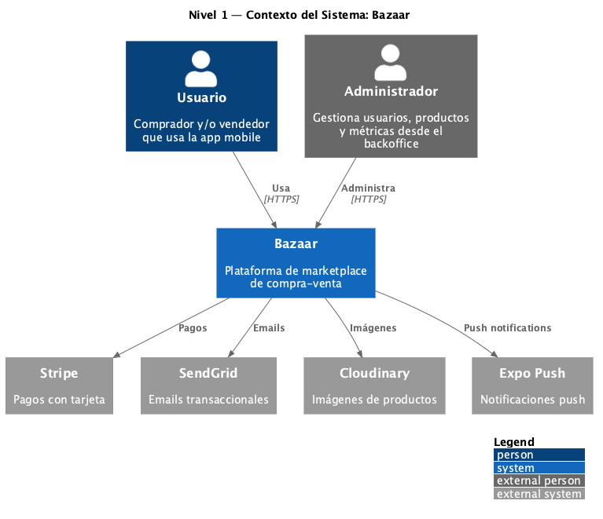
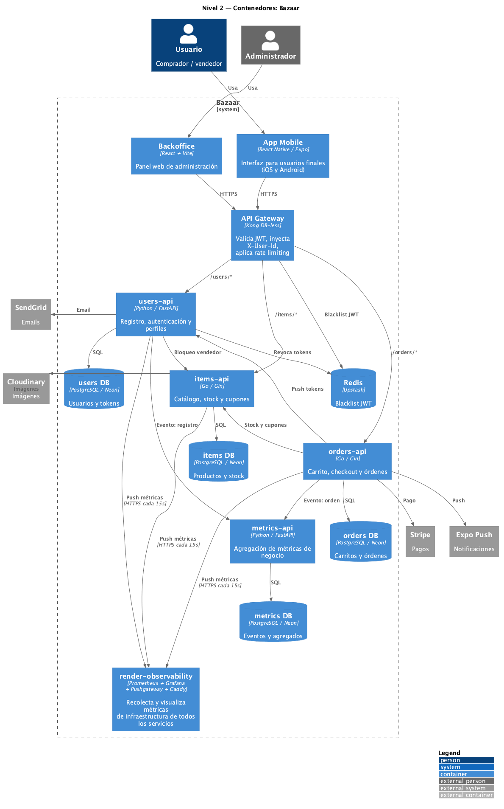
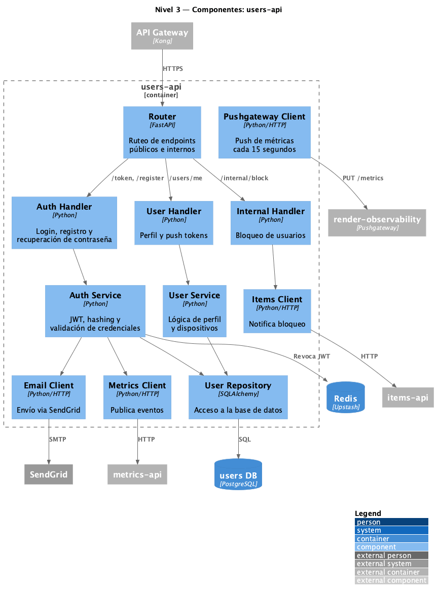
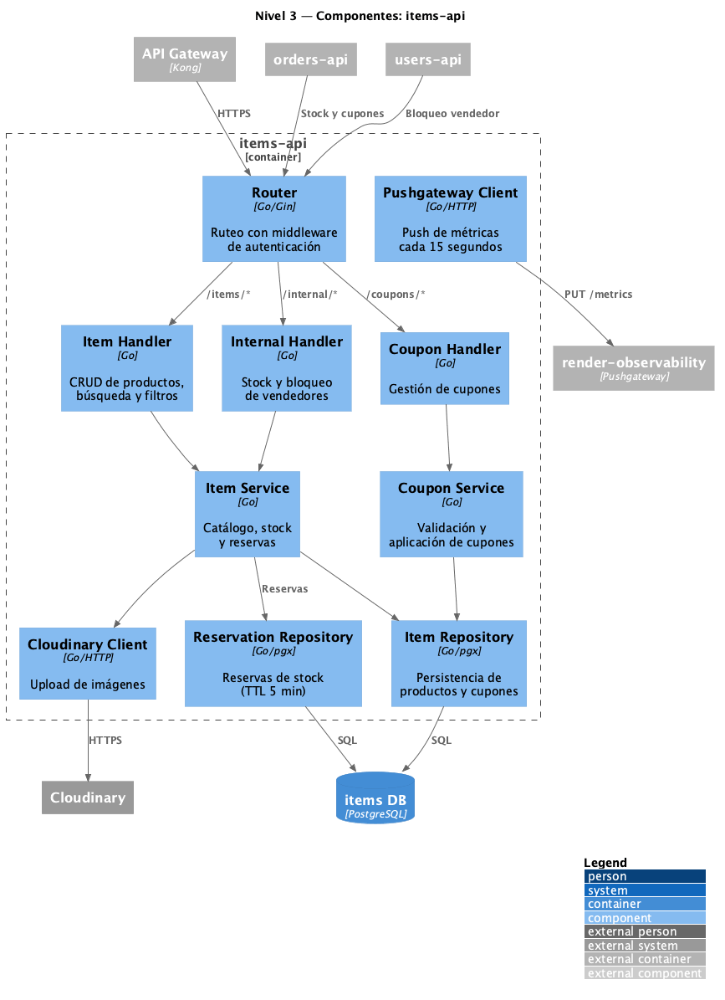
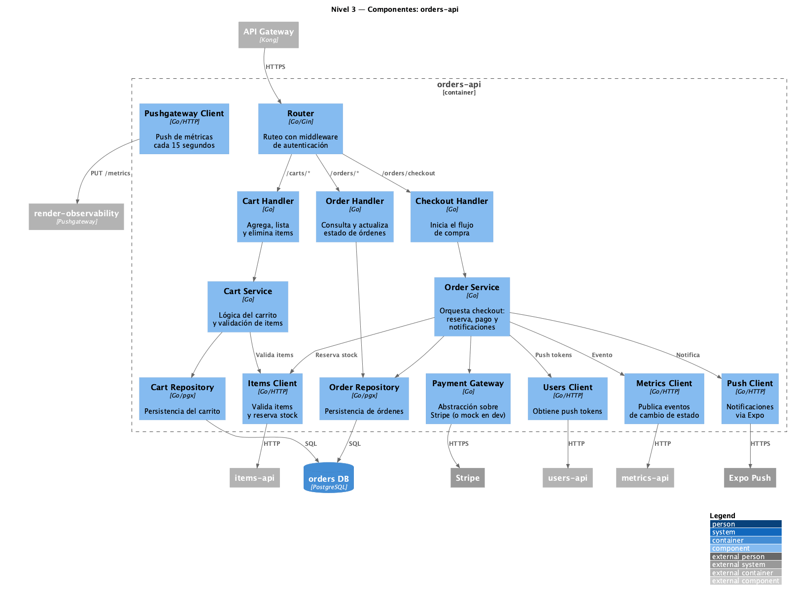
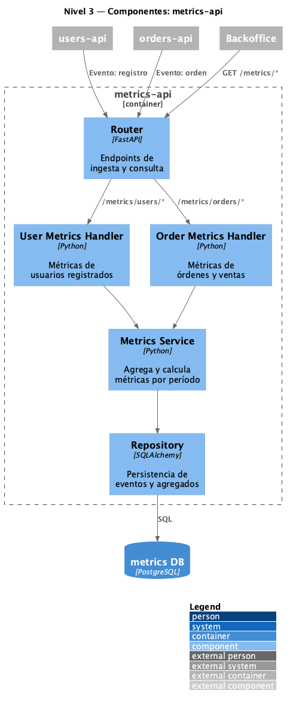
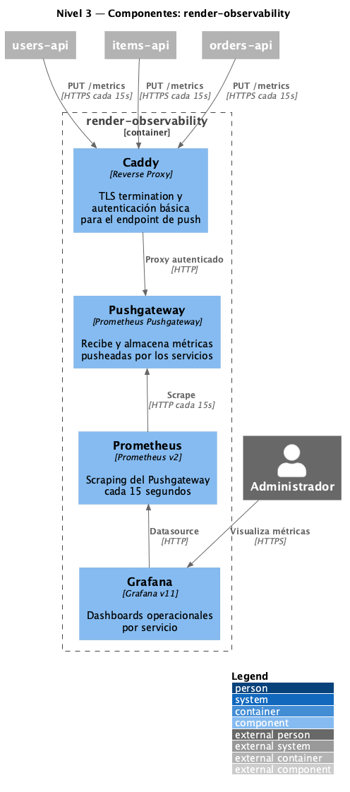

# Arquitectura del Sistema

## Visión General

El sistema está diseñado como una arquitectura de **microservicios** con un API Gateway centralizado que actúa como punto de entrada único para todos los clientes.

---

## Diagrama C4

El sistema se documenta siguiendo el [C4 Model](https://c4model.com/), que describe la arquitectura en niveles de abstracción progresiva: Contexto → Contenedores → Componentes. Los fuentes PlantUML están en [`assets/c4/`](assets/c4/).

---

### Nivel 1 — Contexto del Sistema

Muestra a Bazaar como un sistema único y las entidades externas que interactúan con él.

---

### Nivel 2 — Contenedores

Desglosa el interior de Bazaar en sus aplicaciones y servicios individuales, incluyendo el stack de observabilidad.

---

### Nivel 3 — Componentes

Un diagrama por cada microservicio, mostrando sus módulos internos principales.

#### users-api

#### items-api

#### orders-api

#### metrics-api

#### render-observability

---

## Componentes del Sistema

### Clientes

- **Aplicación mobile** (`app`): Expo / React Native. Interfaz principal para usuarios finales, disponible en iOS y Android.
- **Backoffice** (`backoffice`): React + Vite. Panel de administración web.

Ambos clientes se comunican exclusivamente a través del **API Gateway**.

---

### API Gateway (`gateway-api`)

Punto de entrada centralizado basado en **Kong DB-less**. Enruta las solicitudes hacia los microservicios, valida tokens JWT (RS256), extrae el ID del usuario (claim `sub`) y lo inyecta como header `X-User-Id` hacia los microservicios internos. Las llamadas service-to-service se autentican con el header `X-Internal-Key`. En cada request a rutas protegidas consulta una blacklist en **Redis** para revocar al instante a los usuarios baneados.

---

### Microservicios

#### `users-api`

Registro, autenticación y perfil de usuarios. Maneja recuperación de contraseña por mail (SendGrid) y registro de push tokens de Expo.

- Lenguaje: **Python / FastAPI**
- Base de datos: PostgreSQL (Neon)

#### `items-api`

Catálogo de productos, gestión de stock y cupones de descuento. Integra con Cloudinary para almacenamiento de imágenes.

- Lenguaje: **Go / Gin**
- Base de datos: PostgreSQL (Neon)

#### `orders-api`

Carrito y flujo de compra. Procesa pagos a través de Stripe, reserva stock en `items-api`, valida cupones, envía notificaciones push vía Expo y reporta cambios de estado a `metrics-api`.

- Lenguaje: **Go / Gin**
- Base de datos: PostgreSQL (Neon)

#### `metrics-api`

Agrega eventos del sistema para el backoffice: usuarios registrados y cambios de estado de órdenes. Expone métricas por período (7, 30 o 90 días).

- Lenguaje: **Python / FastAPI**
- Base de datos: PostgreSQL (Neon)

---

### Observabilidad (`render-observability`)

Stack centralizado de observabilidad de infraestructura desplegado en Render. Los microservicios pushean sus métricas cada 15 segundos via HTTPS al Pushgateway (autenticado mediante Caddy con basic auth). Prometheus scraping al Pushgateway y Grafana visualiza los dashboards operacionales.

- **Prometheus**: recolección y almacenamiento de métricas
- **Grafana**: dashboards operacionales por servicio
- **Pushgateway**: recibe métricas en modelo push desde los servicios
- **Caddy**: reverse proxy con TLS y autenticación básica

---

## Comunicación entre servicios

- `orders-api` consulta a `items-api` para validar items, reservar stock y aplicar cupones.
- `orders-api` consulta a `users-api` para obtener push tokens de Expo.
- `orders-api` y `users-api` reportan eventos a `metrics-api`.
- `users-api` notifica a `items-api` cuando un vendedor es bloqueado.
- Todas las llamadas internas viajan con `X-Internal-Key`.
- `users-api`, `items-api` y `orders-api` pushean métricas de infraestructura a `render-observability` cada 15 segundos.

---

## Principios de Diseño

- **Separación de responsabilidades**: cada microservicio tiene su dominio acotado y su propia base de datos.
- **Base de datos por servicio**: ningún servicio accede directamente a la base de datos de otro.
- **Gateway único**: los clientes no conocen la topología interna. Toda comunicación pasa por la API Gateway.
- **Métricas desacopladas**: los servicios publican eventos de negocio a `metrics-api` y métricas de infraestructura a `render-observability` sin bloquear su flujo principal.
