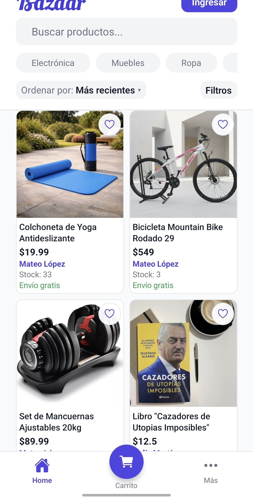
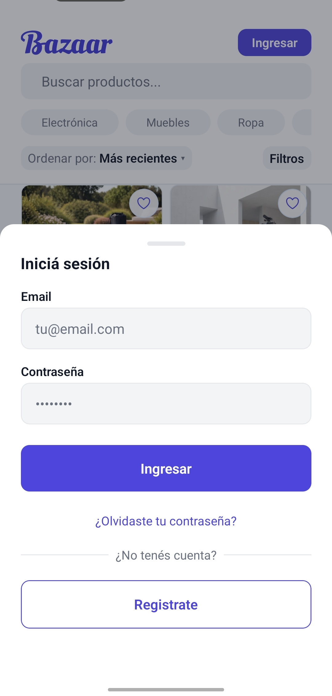
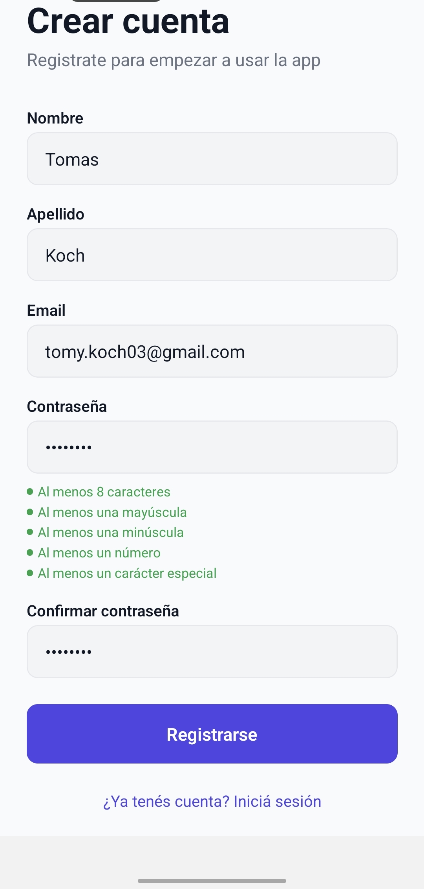
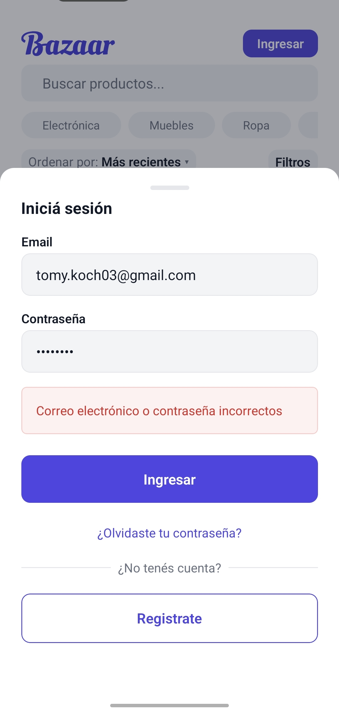
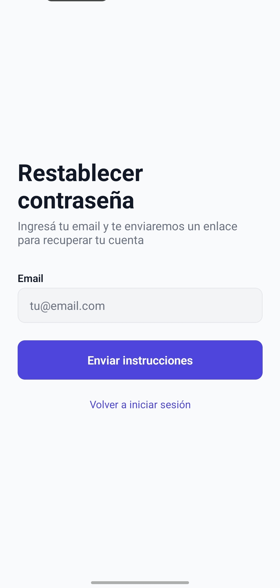
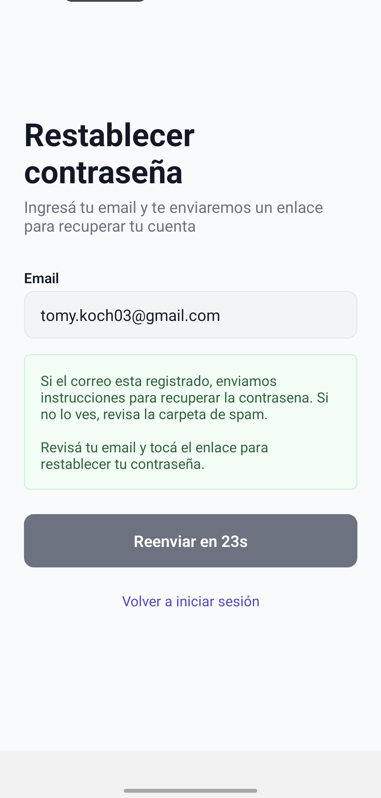
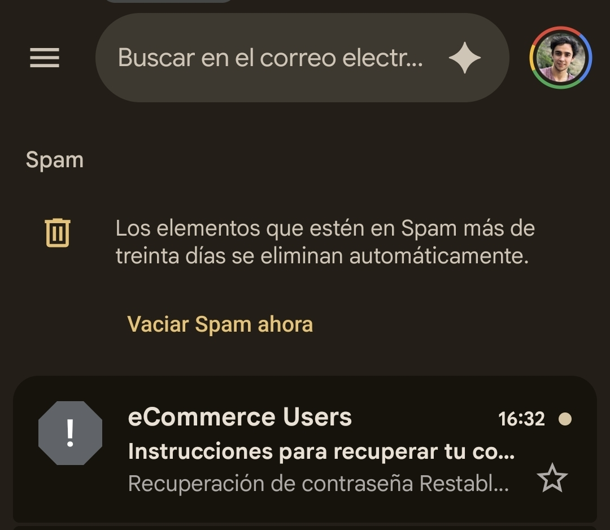
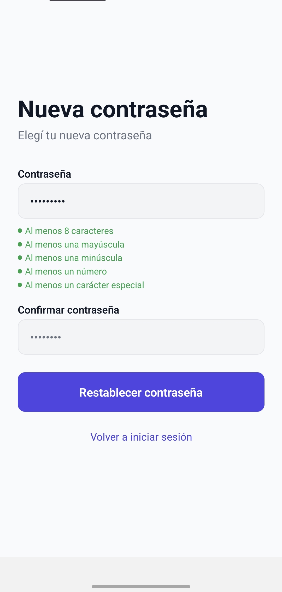
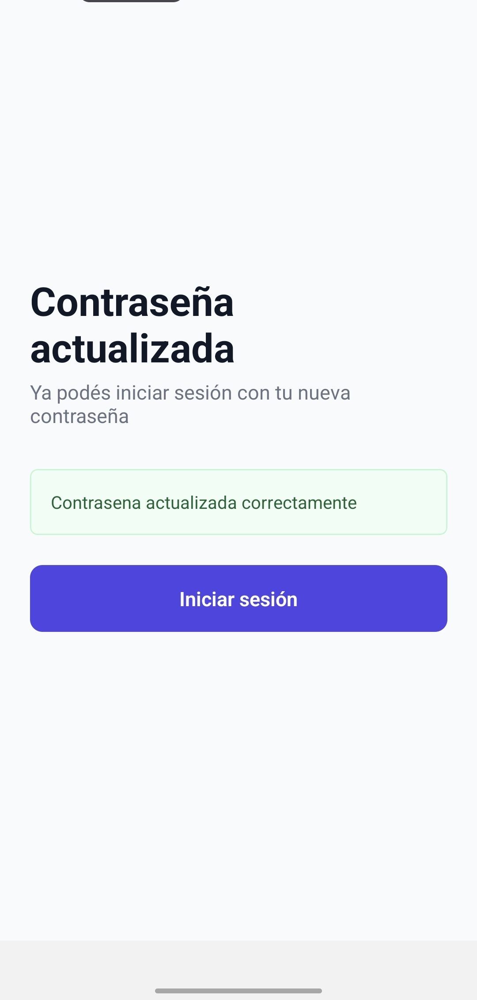
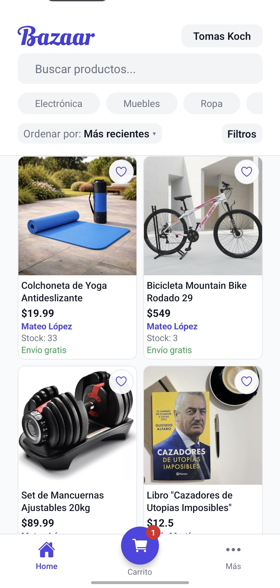

# Acceso y cuenta

Este flujo cubre el ingreso a Bazaar, la creación de una cuenta y la recuperación de contraseña.

## 1. Pantalla principal sin iniciar sesión

La app permite explorar productos desde el inicio. Sin embargo, para comprar, guardar favoritos o gestionar una cuenta, primero hay que ingresar.

## 2. Inicio de sesión

Al tocar `Ingresar` se abre el formulario de acceso. Desde esta pantalla también se puede ir a registro o recuperar la contraseña.

## 3. Registro de cuenta

El alta de usuario solicita nombre, apellido, email, contraseña y confirmación. La app también muestra las reglas mínimas de seguridad de la clave.

## 4. Error de autenticación

Si las credenciales son incorrectas, la app informa el error para que el usuario vuelva a intentarlo.

## 5. Recuperación de contraseña

Si el usuario olvidó su clave, puede ingresar su email y solicitar instrucciones para recuperarla.

## 6. Confirmación de envío del email de recuperación

Después de solicitar la recuperación, la app indica que se enviaron instrucciones y recomienda revisar la carpeta de spam.

## 7. Revisión del correo recibido

El usuario recibe el mensaje con el enlace para continuar el restablecimiento de la contraseña.

## 8. Nueva contraseña

Desde el enlace recibido se accede a la pantalla para definir la nueva clave y confirmarla.

## 9. Contraseña actualizada

Una vez guardada la nueva contraseña, la app confirma la operación y permite volver a iniciar sesión.

## 10. Catálogo ya autenticado

Con la sesión iniciada, el nombre del usuario aparece en la cabecera y ya quedan habilitados los flujos de compra, perfil y venta.
