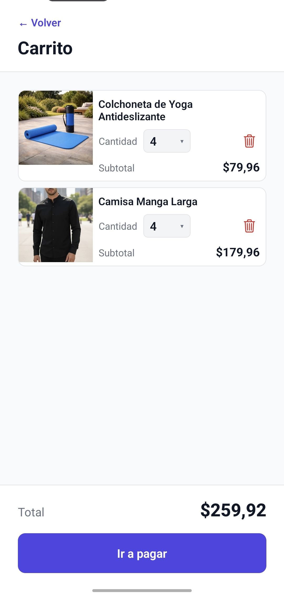
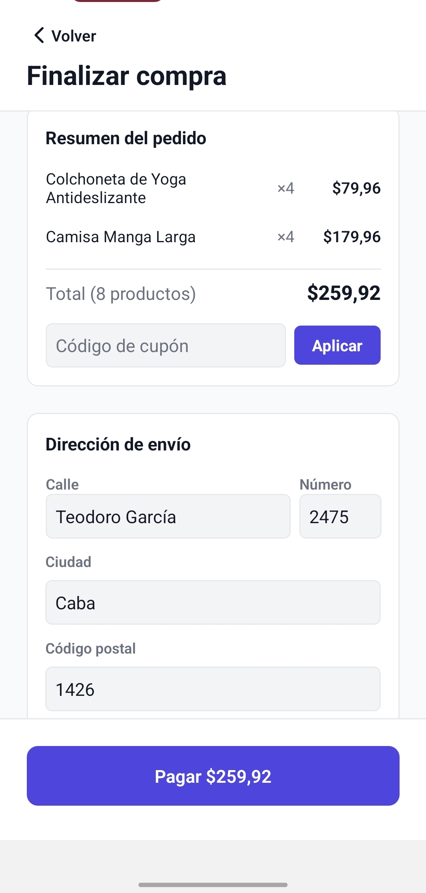
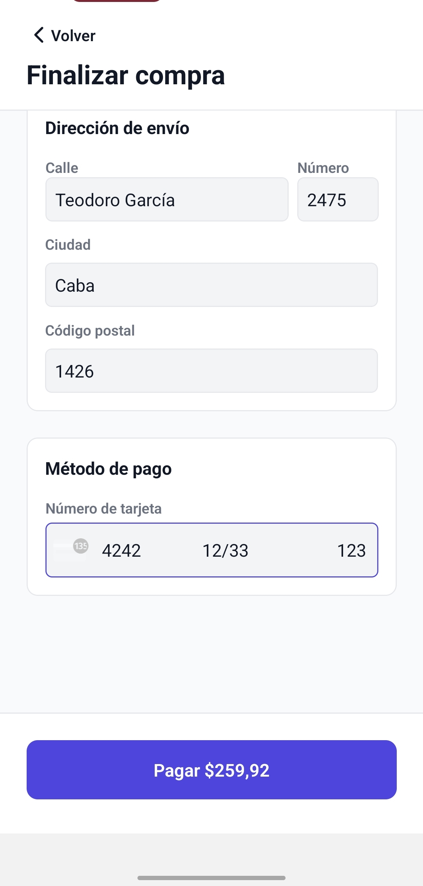
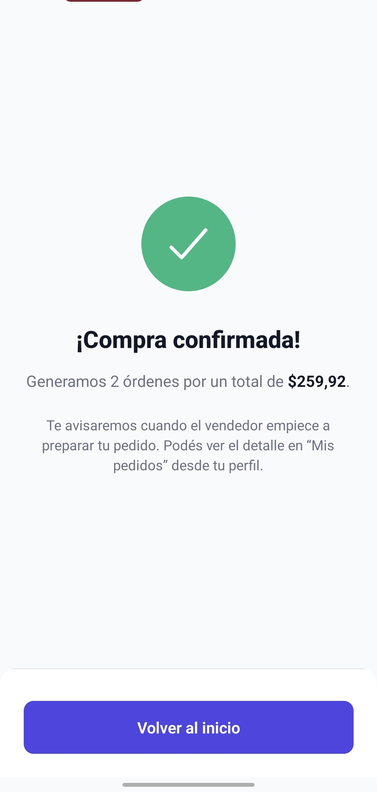
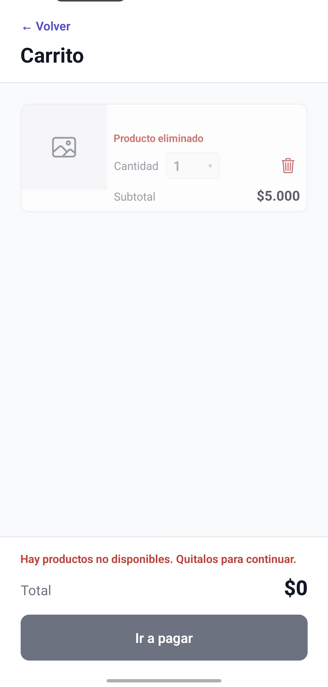
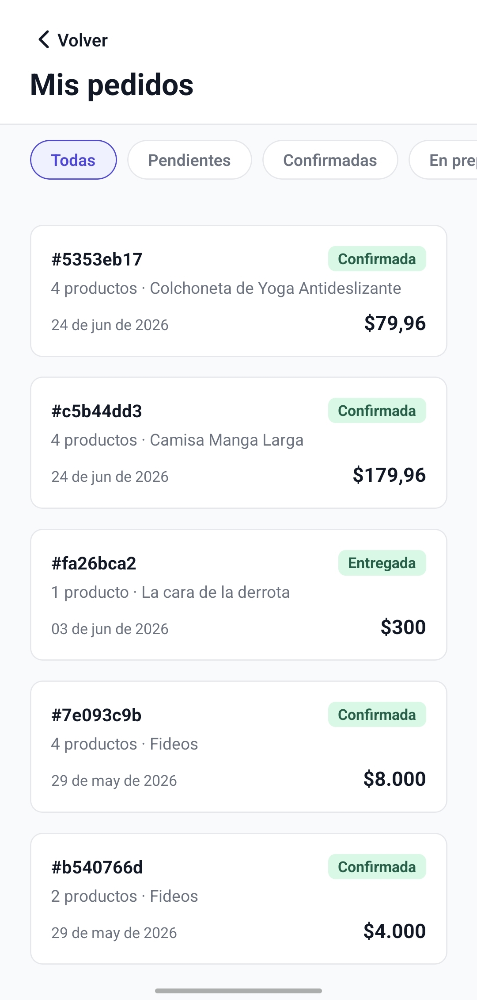

# Compra y pedidos

Este flujo cubre el recorrido del comprador desde el carrito hasta la confirmación y consulta de pedidos.

## 1. Carrito con productos disponibles

En el carrito es posible revisar cada producto, modificar la cantidad y eliminar artículos antes de pagar.

## 2. Checkout: resumen y cupón

La pantalla de checkout resume el pedido y permite aplicar un código de descuento antes de confirmar el pago.

## 3. Checkout: dirección y medio de pago

El usuario completa la dirección de envío y la información de la tarjeta para terminar la operación.

## 4. Compra confirmada

Cuando el pago se procesa correctamente, Bazaar confirma la compra e informa que el detalle podrá seguirse desde `Mis pedidos`.

## 5. Manejo de productos no disponibles

Si un producto deja de estar disponible, el carrito lo marca como eliminado y bloquea el pago hasta que se quite ese ítem.

## 6. Historial de pedidos

La pantalla `Mis pedidos` permite consultar compras anteriores y filtrarlas por estado para seguir su evolución.
