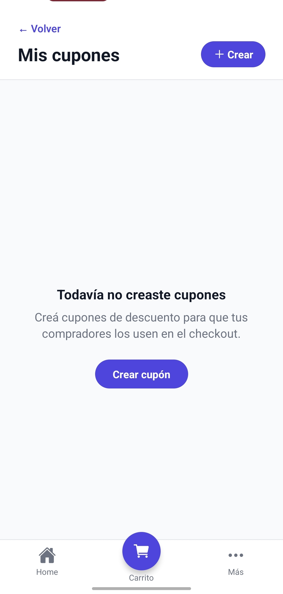
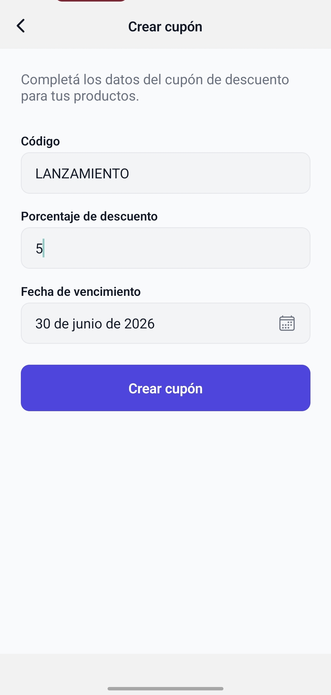

# Cupones

Este flujo muestra cómo crear descuentos para que los compradores los apliquen durante el checkout.

## 1. Estado inicial sin cupones

Si el usuario todavía no creó cupones, la app muestra un estado vacío con acceso directo para generar el primero.

## 2. Crear cupón

El flujo de cupones permite definir código, porcentaje de descuento y fecha de vencimiento para usar en el checkout.
