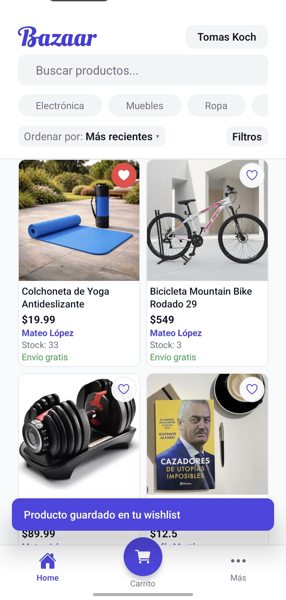
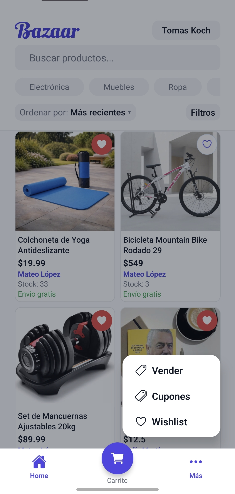
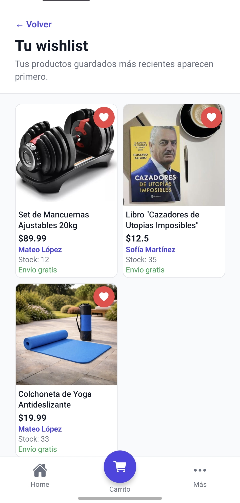
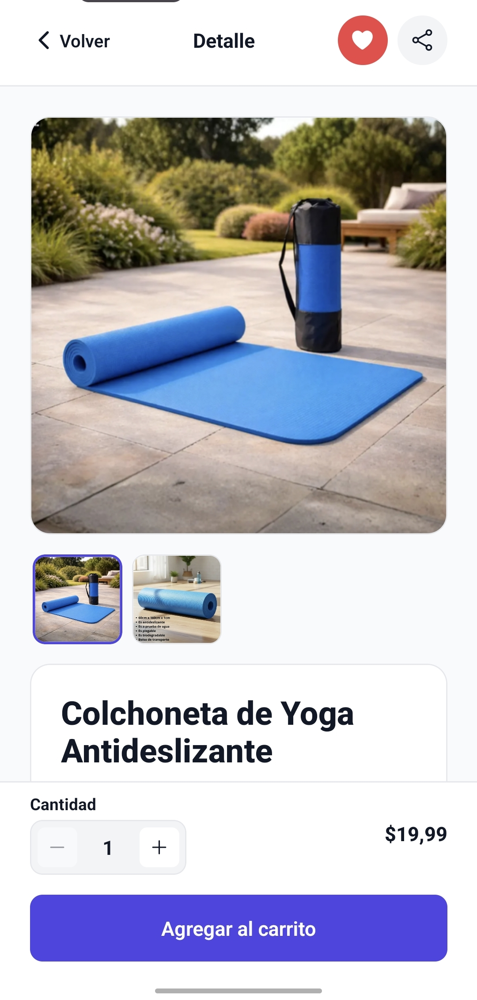
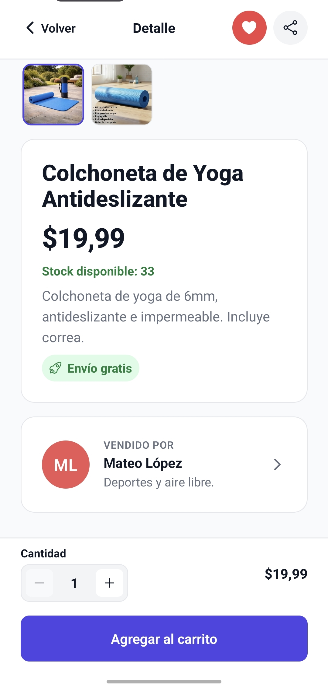

# Exploración y favoritos

Este flujo describe cómo recorrer el catálogo, guardar productos y consultar el detalle de cada publicación.

## 1. Guardar productos en la wishlist

Al tocar el corazón de una tarjeta, el producto se agrega a favoritos y la app lo confirma con un mensaje breve.

## 2. Acceso a opciones desde Más

La pestaña `Más` centraliza accesos rápidos a vender, cupones y wishlist.

## 3. Pantalla de wishlist

La wishlist muestra los productos guardados ordenados por los más recientes para retomarlos más tarde.

## 4. Detalle del producto

Cada publicación tiene una pantalla de detalle con galería de fotos, selector de cantidad y acción para agregar al carrito.

## 5. Información extendida del producto y del vendedor

Además del precio, el usuario puede ver stock disponible, descripción, envío y datos del vendedor.
