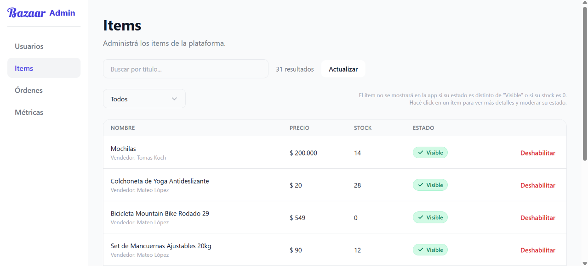
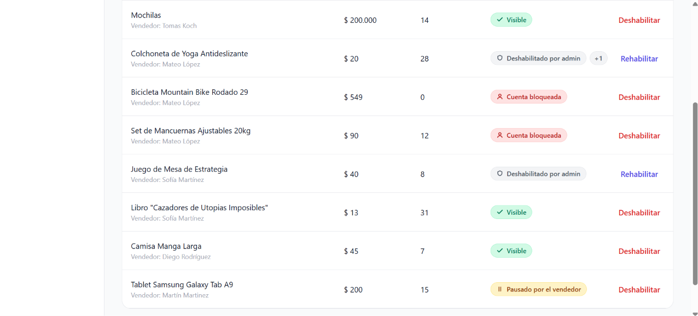
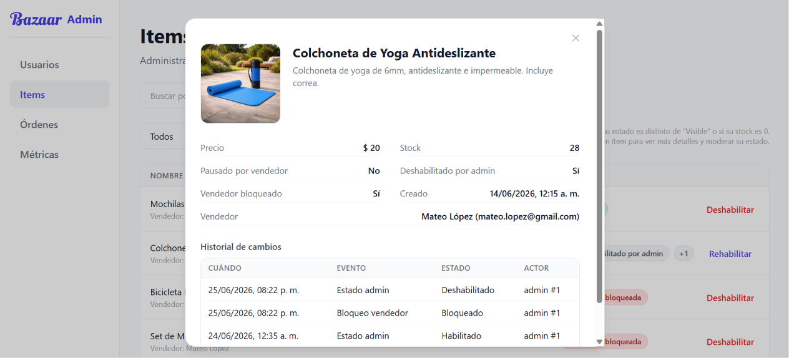
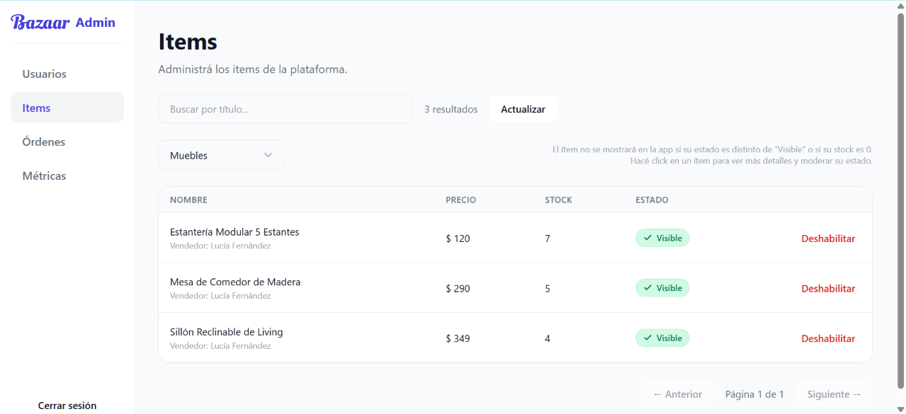

# Items

Accesible al clickear "Items" en la barra lateral.

## 1. Listado de items

Al abrir esta sección, puede verse un listado de los items del sistema con nombre, vendedor, precio, stock y estado (Visible, Pausado por vendedor, Deshabilitado por admin o Cuenta bloqueada).

Clickear en "Actualizar" para refrescar la página y ver nuevos items publicados o cambios en los estados.

Abajo a la derecha del listado de ítems, puede clickearse en "Anterior" o "Siguiente" para navegar y verlos todos.

## 2. Estado de item

Un ítem tiene tres estados posibles: Visible, Pausado por vendedor, Deshabilitado por admin o Cuenta bloqueada. Estos estados no son mutuamente excluyentes: un ítem es "Visible" si no está en ninguno de los otros tres estados; Un ítem puede estar "Pausado por vendedor" y "Deshabilitado por admin" a la vez, o cualquier combinación que haga que un ítem no se vea públicamente en Bazaar. Como se ve en la imagen, en caso de un ítem tener dos estados distintos, se ve sólo uno y un "+1" o "+2" representando que no es el único estado que lo afecta. Para poder ver detalle completo de los estados, leer la siguiente sección.

Puede deshabilitarse un ítem clickeando en "Deshabilitar" y rehabilitarlo clickeando en "Rehabilitar". Esto hará que el ítem deje de verse o vuelva a verse en Bazaar, respectivamente.

## 3. Detalle de item

Al clickear en un ítem (cualquier lugar de la fila en la tabla, excepto el botón de deshabilitar), se accede al detalle del mismo como se ve en la imagen. Puede verse la imagen del producto, precio, stock, sus estados (cada uno de ellos), vendedor (nombre y mail), horario y fecha de creación y un historial de cambio de estados.

## 4. Categoría de item

Puede buscarse un item o grupo de items en particular buscando por nombre en la barra de búsqueda, o también es posible filtrar por categoría de producto, como se ve en la imagen. 