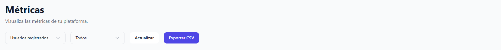
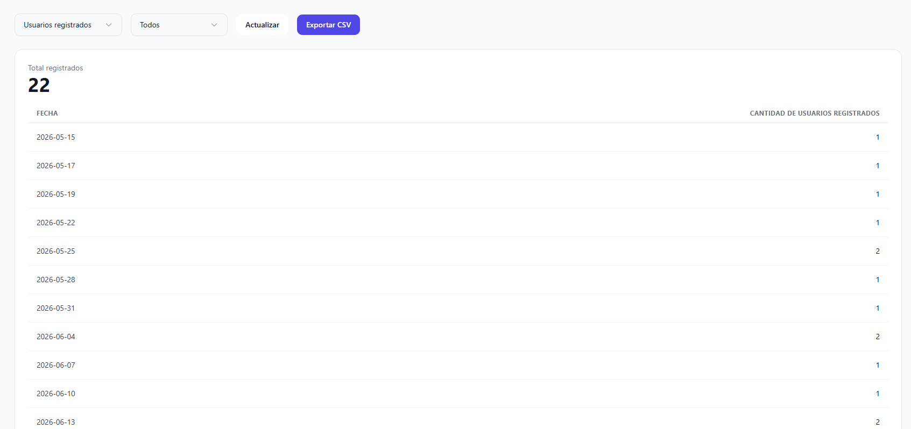
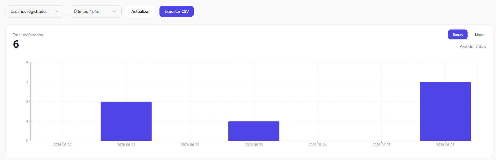
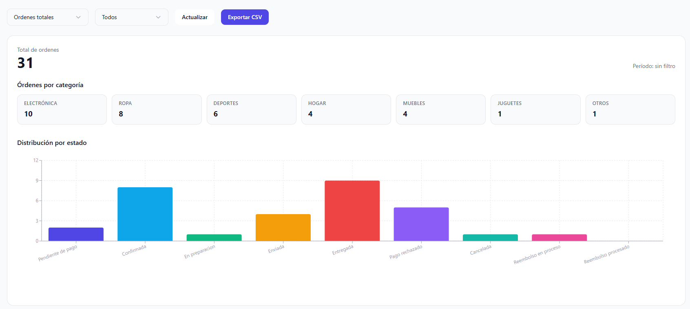
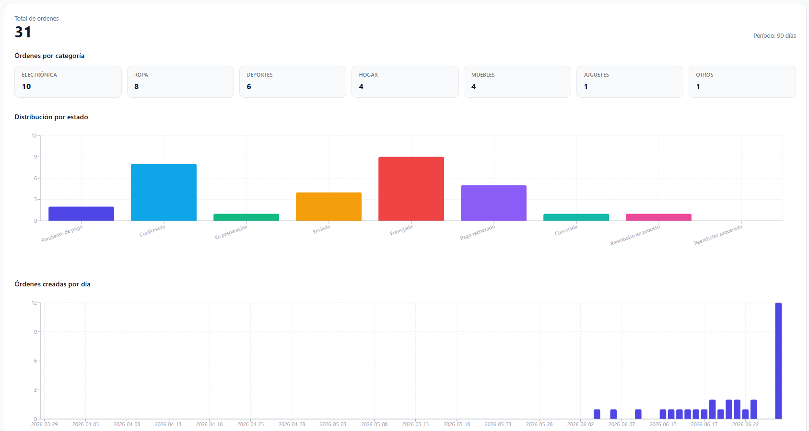
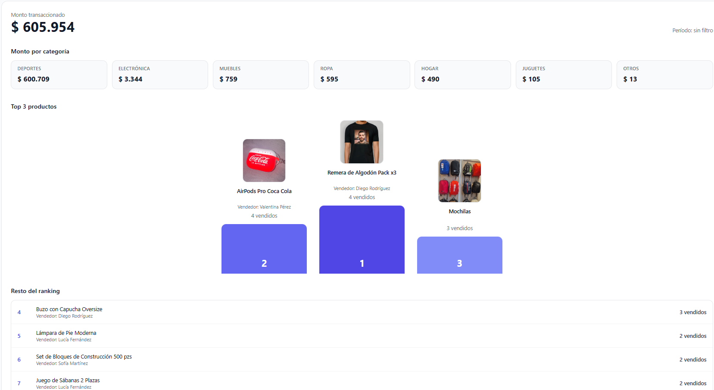

# Métricas

La sección de métricas permite visualizar información agregada sobre la actividad de la plataforma, aplicar filtros temporales y exportar los resultados para su análisis.

## 1. Selección de métrica y período

La pantalla cuenta con dos filtros principales:

- **Métrica:** permite seleccionar entre `Usuarios registrados`, `Órdenes totales` y `Monto transaccionado y ranking`.
- **Período:** permite consultar información de `Todos`, `Últimos 7 días`, `Últimos 30 días` o `Últimos 90 días`.

Además, se dispone de dos acciones:

- **Actualizar:** vuelve a solicitar la información más reciente.
- **Exportar CSV:** descarga un archivo CSV con los datos correspondientes a la métrica y período seleccionados.

## 2. Usuarios registrados

Al seleccionar **Usuarios registrados** y el período **Todos**, se muestra:

- Un KPI con la cantidad total de usuarios registrados.
- Un listado con la cantidad de registros agrupados por fecha.

### Visualización por período

Al seleccionar cualquiera de los períodos temporales, se muestra:

- Un KPI con la cantidad de usuarios registrados dentro del período seleccionado.
- Un gráfico de evolución temporal de registros.

La visualización puede alternarse entre:

- **Gráfico de barras**, mostrando la cantidad de registros por fecha.
- **Gráfico de líneas**, mostrando la evolución de registros a lo largo del tiempo.

## 3. Órdenes totales

Al seleccionar **Órdenes totales** y el período **Todos**, se muestra:

- Un KPI con la cantidad total de órdenes.
- Un resumen de órdenes por categoría.
- Un gráfico con la distribución de órdenes por estado.

### Visualización por período

Al seleccionar un período temporal, toda la información se recalcula considerando únicamente las órdenes comprendidas dentro del período seleccionado.

Además, se incorpora un gráfico de **órdenes creadas por día**, que permite visualizar la evolución diaria de la actividad.

## 4. Monto transaccionado y ranking

Al seleccionar **Monto transaccionado y ranking** y el período **Todos**, se muestra:

- Un KPI con el monto total transaccionado.
- Un resumen del monto transaccionado por categoría.
- Un ranking con los tres productos más vendidos, mostrando su imagen, vendedor y cantidad vendida.
- Un listado con las posiciones restantes hasta completar el Top 10 de productos más vendidos.

### Visualización por período

Al seleccionar cualquiera de los períodos temporales, toda la información se recalcula utilizando únicamente las ventas realizadas dentro del período seleccionado:

- KPI de monto transaccionado.
- Monto transaccionado por categoría.
- Ranking de productos más vendidos (Top 10).

