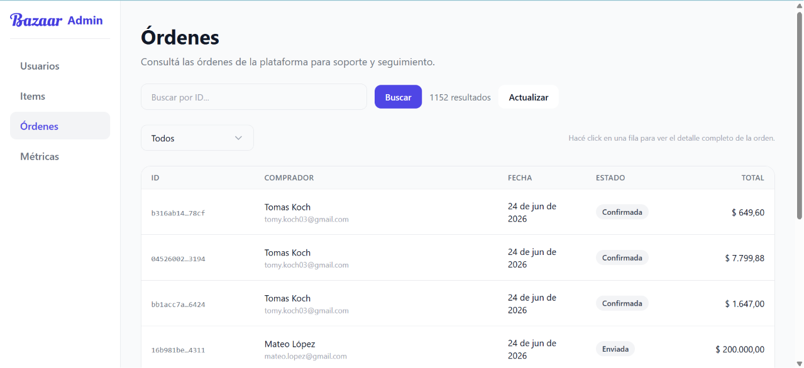
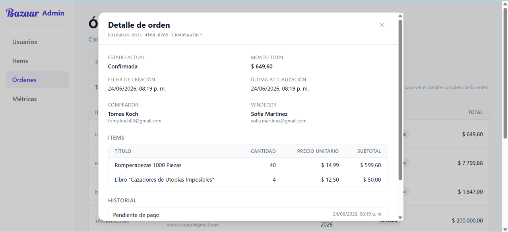

# Órdenes

Accesible al clickear "Órdenes" en la barra lateral.

## 1. Listado de órdenes

Al abrir esta sección, puede verse un listado de las órdenes del sistema con id, comprador (nombre y mail), fecha, estado y valor total.

Clickear en "Actualizar" para refrescar la página y ver nuevas ordenes realizadas o cambios en los estados.

Abajo a la derecha del listado, puede clickearse en "Anterior" o "Siguiente" para navegar y ver todas las órdenes.

Es posible filtrar las órdenes por estado, clickeando en el botón que dice "Todos" y seleccionando la que se quiera.

## 2. Detalle de orden

Al buscar una orden por ID o clickear en una (cualquier lugar de la fila en la tabla), se accede al detalle de la misma como se ve en la imagen. Puede verse el estado actual, monto total, fecha de creación, última actualización, comprador (nombre y mail), vendedor (nombre y mail), ítems que forman parte de la orden con sus respectivas cantidades y precios, y un historial de los cambios de estado.

Es posible acceder directamente al detalle de un ítem clickeando en el nombre del mismo dentro del detalle de orden.