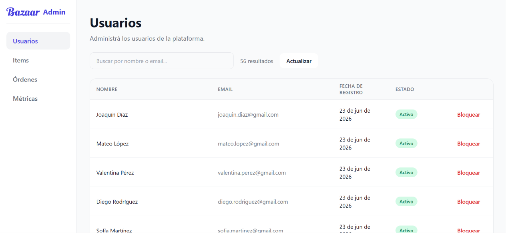
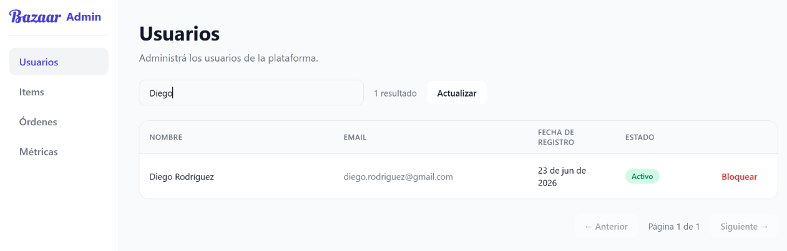
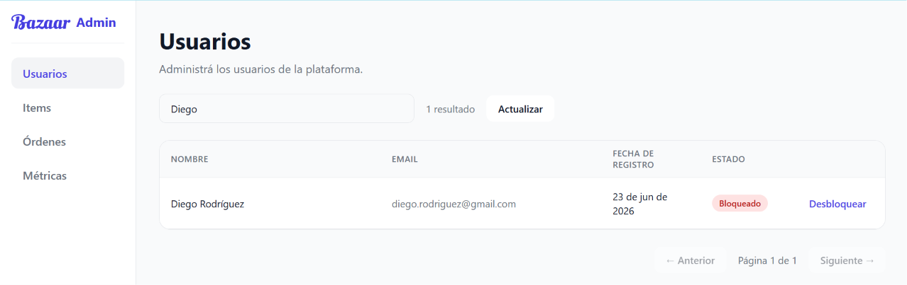

# Usuarios

Accesible al clickear "Usuarios" en la barra lateral.

## 1. Listado de usuarios

Al abrir esta sección, puede verse un listado de los usuarios del sistema con sus nombres, direcciones de correo, fecha de registración y su estado (Activo o Bloqueado). 

Clickear en "Actualizar" para refrescar la página y ver nuevos usuarios registrados.

Como se visualiza en la segunda imagen, puede clickearse en "Anterior" o "Siguiente" para navegar y ver todos los usuarios.  

## 2. Búsqueda de usuarios

Al hacer click en la barra de búsqueda ("Buscar por nombre o mail..."), es posible escribir el nombre o el mail de un usuario o un grupo de usuarios en particular para ver sus datos. 

## 3. Bloqueo de usuario

A la derecha de cada usuario, el botón "Bloquear" permite bloquearlo para revocar su accesso a Bazaar. Luego de realizada esa acción, el usuario no tendrá acceso a ninguna función de la app, será automáticamente deslogueado y sus productos ya no serán visibles.

Es posible desbloquear a un usuario clickeando en "Desbloquear", devolviendo acceso al mismo y haciendo disponible sus items publicados.