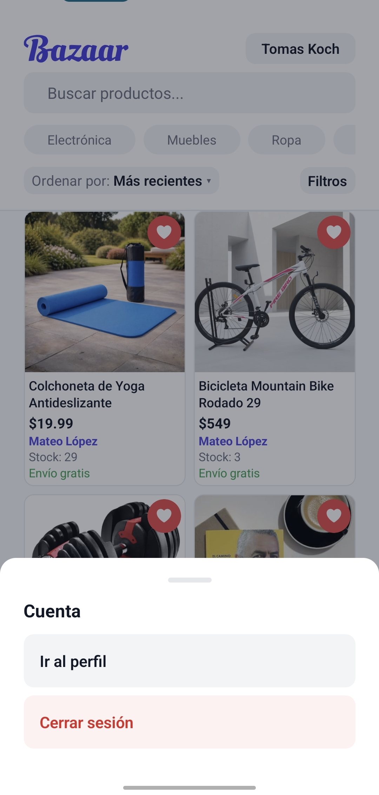
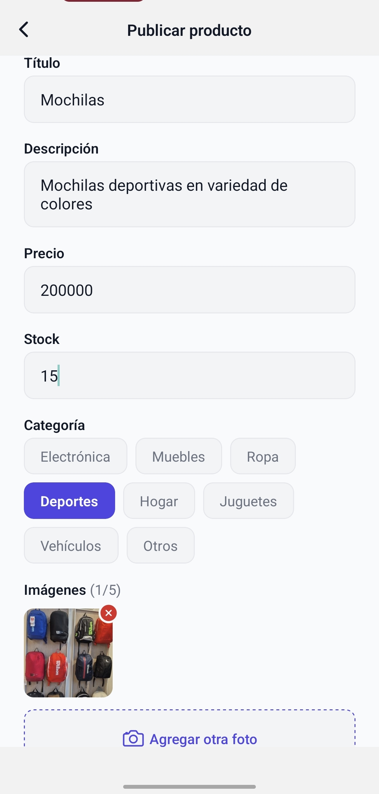

# Perfil y publicaciones

Este flujo reúne la gestión de la cuenta personal y la creación de nuevas publicaciones para vender.

## 1. Menú de cuenta

Desde el nombre del usuario se abre un menú con acceso al perfil y la opción de cerrar sesión.

## 2. Perfil del usuario

El perfil centraliza las publicaciones activas, el acceso a `Mis pedidos`, `Mis ventas` y el cierre de sesión.

## 3. Edición de perfil

El usuario puede cambiar su foto, nombre, apellido y descripción pública. El email se muestra como dato privado y no editable desde esta pantalla.

## 4. Crear una publicación

Para vender, el usuario completa título, descripción, precio, stock, categoría e imágenes del producto.
