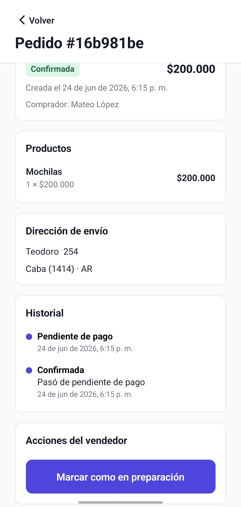
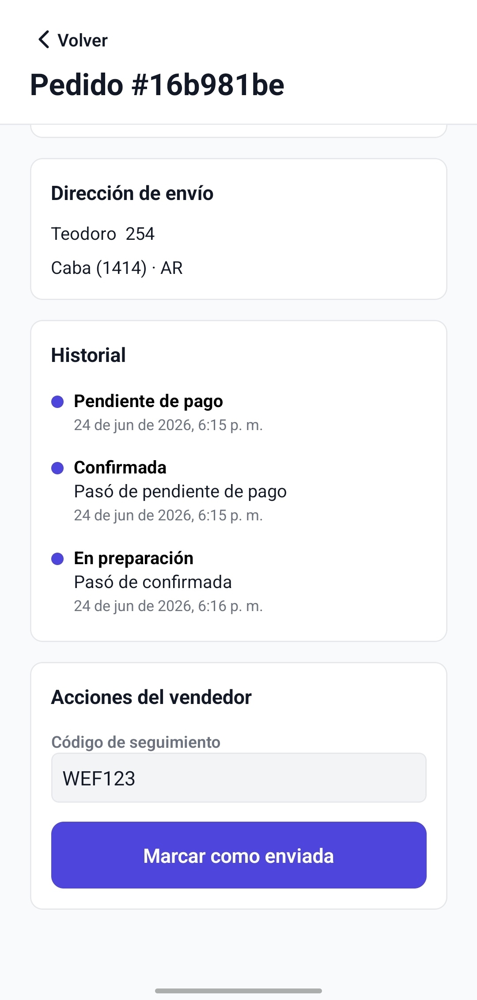
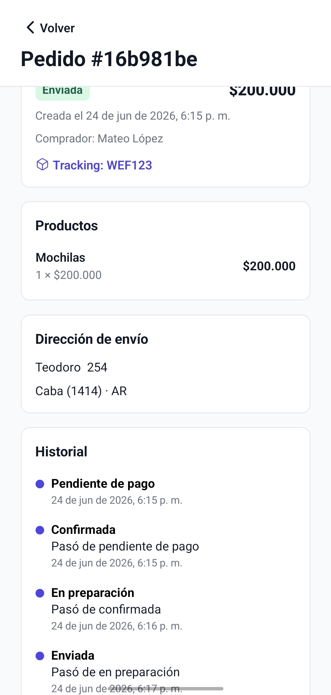

# Ventas

Este flujo muestra cómo un vendedor revisa sus órdenes y actualiza el estado de cada envío.

## 1. Listado de ventas

La sección `Mis ventas` muestra las órdenes recibidas, con filtros por estado y el importe correspondiente a cada venta.

## 2. Detalle de una venta

Dentro de cada venta se puede consultar el comprador, los productos, la dirección de entrega y el historial del pedido.

## 3. Preparación del envío

Cuando la venta pasa a preparación, el vendedor puede cargar un código de seguimiento y avanzar el estado del pedido.

## 4. Pedido enviado

Una vez despachado, el detalle deja visible el tracking y registra el cambio de estado en el historial.
