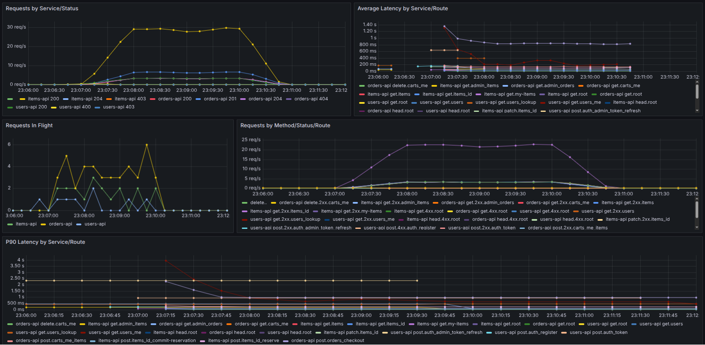
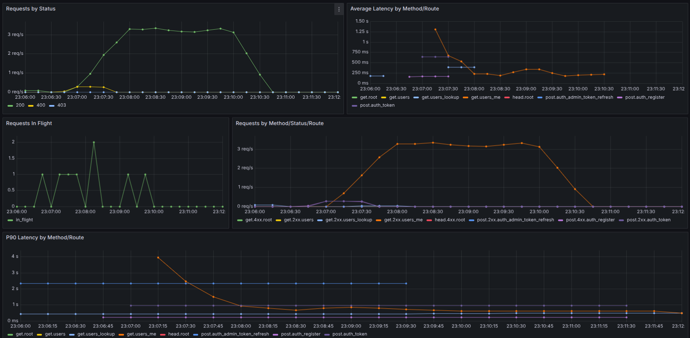
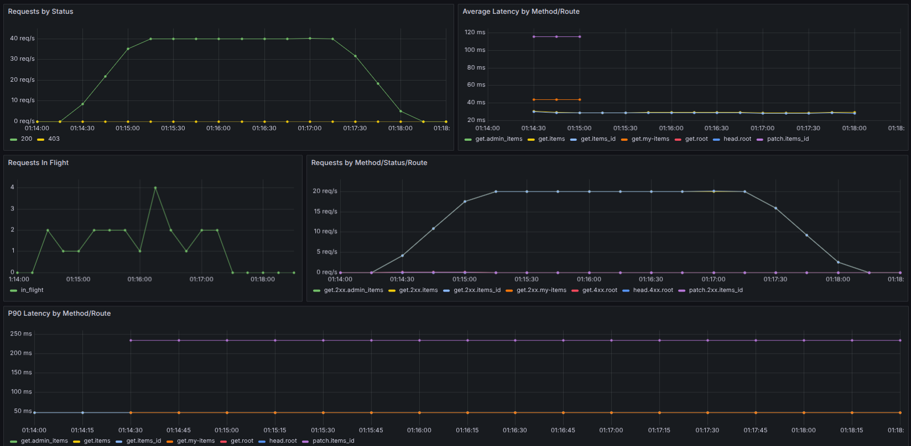
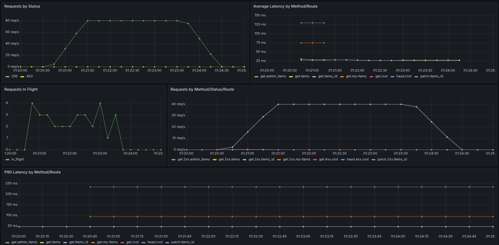
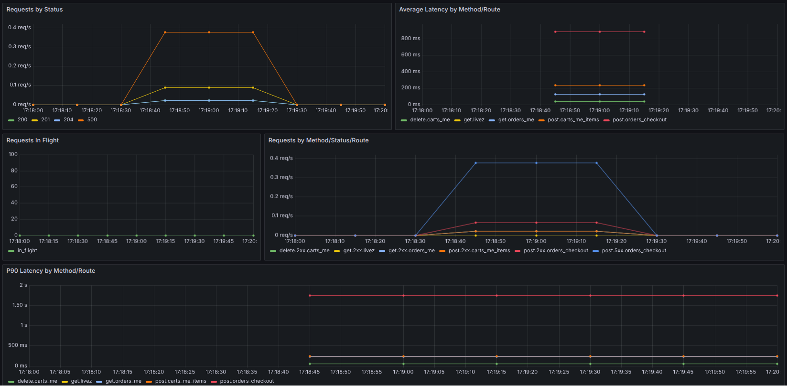

# Pruebas de Performance

## Objetivo

Este informe resume las pruebas de performance ejecutadas sobre la aplicación a partir de los escenarios definidos en [`performance-tests/`](../performance-tests/) y las métricas observadas en los dashboards de [`render-observability/`](../render-observability/).

El foco del análisis está puesto en:

- validar el comportamiento del flujo principal de compra bajo carga;
- estimar la capacidad observable del catálogo;
- detectar cuellos de botella por microservicio;
- registrar fallas funcionales o de concurrencia que aparezcan durante las corridas.

## Metodología

Las corridas relevadas fueron ejecutadas con `k6` a través de los comandos documentados en [`performance-tests/README.md`](../performance-tests/README.md). Para la observabilidad se utilizó el dashboard principal [`Render APIs - Operational`](http://metrics-grafana.ddns.net:3010/d/render-apis-operational/render-apis-operational), complementado por dashboards específicos de `users-api`, `items-api` y `orders-api`.

Los escenarios considerados en este informe son:

- `load`: recorrido completo de compra con concurrencia sostenida.
- `stress`: incremento rápido de usuarios virtuales para observar degradación y recuperación.
- `capacity`: medición de tasa sostenible sobre lecturas del catálogo.
- `concurrency`: validación de idempotencia en `checkout`.

## Resumen ejecutivo

Las corridas muestran que el sistema soporta correctamente el flujo principal de compra con hasta `10 VUs` en una ventana corta, sin errores HTTP y con latencias generales aceptables. El servicio más sensible en la prueba de carga estable fue `users-api`, ya que el endpoint `GET /users/me` superó el umbral de `p95 < 1000 ms`.

Sobre el catálogo, la plataforma sostuvo sin errores una tasa de `40 req/s` durante `3 minutos` con `p95` cercano a `212 ms` y sin `dropped_iterations`. Al subir a `80 req/s`, la latencia siguió estable, pero aparecieron `10 dropped_iterations`, por lo que esa tasa no puede considerarse sostenible en este ambiente bajo la configuración usada.

El hallazgo más importante no es de capacidad sino de correctitud: la prueba de concurrencia detectó una condición de carrera en `orders-api` para `POST /orders/checkout` con la misma `idempotencyKey`, generando respuestas `500` aun cuando la base evita la duplicación de órdenes.

Como panorama general, la siguiente captura del dashboard principal `Render APIs - Operational` durante la corrida `make load VUS=10 DURATION=3m` permite ver de forma transversal cómo se distribuyeron el tráfico y la latencia entre los microservicios involucrados en el flujo de compra.



## Corridas analizadas

| Fecha | Ventana observada | Comando | Resultado |
|---|---|---|---|
| 2026-06-21 | 23:06 a 23:12 | `make load VUS=10 DURATION=3m` | Sin errores HTTP, pero falla threshold en `users_me` |
| 2026-06-23 | 00:43 a 00:46 | `make stress PEAK_VUS=10 RAMP_UP=5s HOLD=30s RAMP_DOWN=30s` | Exitosa |
| 2026-06-23 | 01:07 a 01:11:45 | `make capacity RATE=10 CAPACITY_DURATION=3m DISABLE_PRODUCTS_AFTER_TEST=false` | Exitosa |
| 2026-06-23 | 01:14 a 01:18:30 | `make capacity RATE=40 CAPACITY_DURATION=3m DISABLE_PRODUCTS_AFTER_TEST=false` | Exitosa |
| 2026-06-23 | 01:20 a 01:25 | `make capacity RATE=80 CAPACITY_DURATION=3m DISABLE_PRODUCTS_AFTER_TEST=false` | Falla threshold por `dropped_iterations=10` |
| s/d | s/d | `make concurrency CONCURRENT_REQUESTS=20` | Detecta bug de idempotencia en `checkout` |

## Resultados por escenario

### 1. Carga estable del buyer journey

Corrida:

```bash
make load VUS=10 DURATION=3m
```

Resultados principales:

- `http_req_failed`: `0.00%`
- `http_req_duration p95`: `1.02 s`
- `iterations`: `564`
- `http_reqs`: `3986`
- `orders_checkout p95`: `1.09 s`
- `items_list p95`: `240.41 ms`
- `cart_add p95`: `372.59 ms`
- `users_me p95`: `1.14 s`

Lectura:

- El flujo completo de compra se sostuvo de punta a punta sin errores.
- `orders-api` respondió dentro del umbral definido para checkout.
- `items-api` mostró buen comportamiento en el acceso al catálogo.
- El principal punto de atención fue `users-api`, ya que `GET /users/me` excedió el threshold establecido.

Antes de entrar al detalle por servicio, la captura del dashboard principal también muestra que la mayor parte del tráfico del escenario se concentró en `items-api`, con participación sostenida de `users-api` y `orders-api`, sin errores generalizados en la ventana observada.

Evidencia visual:

La siguiente captura del dashboard `Users API Render - Operational` muestra justamente ese comportamiento. Se observa que la ruta `GET /users/me` concentra la mayor latencia del servicio durante la ventana de carga, mientras que el resto de las rutas se mantiene en valores menores.



Conclusión:

La arquitectura tolera una carga sostenida de `10` compradores concurrentes durante `3 minutos`, pero el perfil del servicio de usuarios merece una revisión para evitar que sea el primer cuello de botella del flujo completo.

### 2. Stress con pico corto

Corrida:

```bash
make stress PEAK_VUS=10 RAMP_UP=5s HOLD=30s RAMP_DOWN=30s
```

Resultados principales:

- `http_req_failed`: `0.00%`
- `http_req_duration p95`: `1.19 s`
- `iterations`: `153`
- `http_reqs`: `1109`
- `orders_checkout p95`: `1.32 s`
- `users_me p95`: `569.17 ms`

Lectura:

- El sistema absorbió correctamente una subida rápida hasta `10 VUs`.
- No se observaron errores de aplicación ni un deterioro abrupto de latencia.
- A diferencia de la carga estable, en esta corrida `users-api` permaneció dentro del threshold.

Conclusión:

Para un pico breve, el comportamiento observado fue estable y no mostró señales de degradación crítica ni recuperación anómala.

### 3. Capacidad del catálogo

#### RATE=10 req/s

Corrida:

```bash
make capacity RATE=10 CAPACITY_DURATION=3m DISABLE_PRODUCTS_AFTER_TEST=false
```

Resultados principales:

- `http_req_failed`: `0.00%`
- `dropped_iterations`: `0`
- `http_req_duration p95`: `211.51 ms`
- `http_req_duration p99`: `329.52 ms`
- `iterations`: `1801`

Lectura:

- El sistema sostuvo sin dificultad la tasa pedida.
- La latencia fue baja y estable.

#### RATE=40 req/s

Corrida:

```bash
make capacity RATE=40 CAPACITY_DURATION=3m DISABLE_PRODUCTS_AFTER_TEST=false
```

Resultados principales:

- `http_req_failed`: `0.00%`
- `dropped_iterations`: `0`
- `http_req_duration p95`: `211.88 ms`
- `http_req_duration p99`: `314.08 ms`
- `iterations`: `7201`

Lectura:

- La tasa de `40 req/s` también se sostuvo correctamente.
- La latencia fue prácticamente igual a la corrida de `10 req/s`.
- No hubo indicios de saturación real en `items-api` para este escalón.

Evidencia visual:

En la captura de `Items API Render - Operational` se ve una meseta cercana a `40 req/s`, sin errores visibles por estado y con latencias promedio y `P90` estables. Esta es la mejor evidencia visual para respaldar la capacidad sostenible observada.



#### RATE=80 req/s

Corrida:

```bash
make capacity RATE=80 CAPACITY_DURATION=3m DISABLE_PRODUCTS_AFTER_TEST=false
```

Resultados principales:

- `http_req_failed`: `0.00%`
- `dropped_iterations`: `10`
- `http_req_duration p95`: `211.13 ms`
- `http_req_duration p99`: `326.4 ms`
- `iterations`: `14391`

Lectura:

- La latencia siguió siendo baja, pero la corrida no cumplió el threshold por `dropped_iterations`.
- Esto indica que, con la configuración usada, `80 req/s` no debe reportarse como capacidad sostenible.
- Antes de concluir una saturación definitiva del sistema, conviene validar si el límite viene del generador o del servicio, aumentando `MAX_VUS` y revisando el comportamiento de `items-api` en el dashboard específico.

Evidencia visual:

La captura correspondiente a `80 req/s` muestra que el servicio mantuvo una forma estable de tráfico y latencia. Eso refuerza que el problema observado no fue una explosión de tiempos de respuesta, sino la invalidez de la corrida por `dropped_iterations`.



Conclusión general de capacidad:

Con la evidencia actual, la capacidad observable y sostenible del catálogo es al menos `40 req/s` durante `3 minutos`. La corrida de `80 req/s` es prometedora por latencia, pero todavía no es válida como capacidad consolidada por la aparición de iteraciones descartadas.

### 4. Concurrencia e idempotencia en checkout

Corrida:

```bash
make concurrency CONCURRENT_REQUESTS=20
```

Hallazgo:

- Se detectó una condición de carrera en `orders-api` cuando múltiples requests concurrentes ejecutan `POST /orders/checkout` con la misma `idempotencyKey`.
- El comportamiento esperado era que todas las respuestas devolvieran éxito y referenciaran la misma orden.
- El comportamiento observado fue mixto: algunas requests devolvieron `201`, varias devolvieron `500`, y la base persistió una única orden.

Interpretación técnica:

- La restricción única de base de datos protege la integridad de los datos.
- La capa de aplicación no resuelve correctamente la colisión concurrente.
- El problema impacta sobre un flujo crítico del negocio, porque puede manifestarse ante doble click, reintentos automáticos o conexiones inestables.

Evidencia visual:

La captura de `Orders API Render - Operational` resulta consistente con este hallazgo: aparecen respuestas `500` junto con respuestas exitosas para la misma ventana de ejecución, y la ruta de `checkout` concentra la mayor latencia del servicio. La ventana visible en el dashboard corresponde a un tramo breve de la corrida de concurrencia, aproximadamente entre `17:18:45` y `17:19:20`.



Prioridad:

Este hallazgo debe considerarse de alta prioridad, porque afecta la confiabilidad del checkout aun sin generar órdenes duplicadas.

## Interpretación por microservicio

### `users-api`

- Es el servicio más comprometido en la corrida de carga estable.
- El endpoint `GET /users/me` fue el único que quebró un threshold funcional.
- Conviene revisar tiempos de respuesta, acceso a base y posibles costos de autenticación o composición de perfil.

### `items-api`

- Fue el servicio con comportamiento más estable en las pruebas de catálogo.
- Mantuvo latencias bajas incluso al escalar de `10` a `80 req/s`.
- Es el mejor candidato para mostrar un dashboard específico que evidencie capacidad y estabilidad.

### `orders-api`

- El tiempo de checkout se mantuvo dentro de los umbrales en `load` y `stress`.
- Sin embargo, el mayor riesgo funcional apareció en este servicio por el bug de idempotencia concurrente.
- Más que capacidad, acá importa mostrar cómo evolucionan `status`, `in_flight` y latencia por ruta durante la prueba de concurrencia.

## Conclusión

El sistema mostró un desempeño general satisfactorio en pruebas cortas de carga y stress, con especial solidez en las lecturas de catálogo. La evidencia disponible permite reportar como resultado confiable una capacidad observable de al menos `40 req/s` para el escenario de catálogo.

Los dos puntos de mejora más claros son:

- la latencia de `users-api` en el flujo estable de compra;
- la condición de carrera de `orders-api` frente a requests concurrentes con la misma `idempotencyKey`.

Ambos hallazgos son relevantes, pero el segundo es el más crítico por su impacto directo sobre la robustez del checkout.
